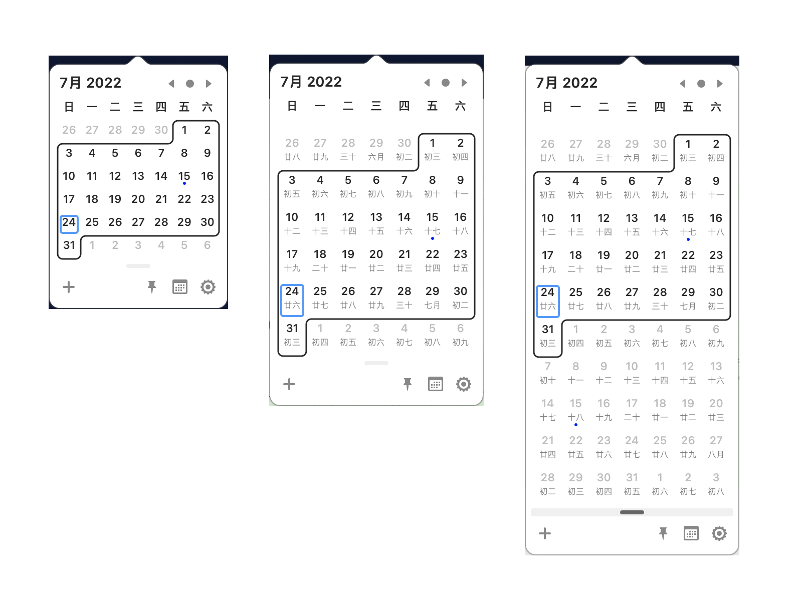

# Itsycal


Itsycal is a utility tiny menu bar app for macOS. 

I have been using it for several years. many thanks to [mowgliiapps](https://twitter.com/intent/follow?screen_name=mowgliiapps) for it's free software and open source.

For people with Chinese cultural background, they may need a calendar with lunar date display, so I developed a feature to display lunar date on Itsycal.

The lunar display setting:
```Objc
	//ViewController.m
	...
    [_moCal bind:@"showLunar" 
		toObject:[NSUserDefaultsController sharedUserDefaultsController] 
		withKeyPath:[@"values." stringByAppendingString:kShowLunarDate] 
		options:@{NSContinuouslyUpdatesValueBindingOption: @(YES)}];
	...
```

The dependencies:
* [LunarCore](https://github.com/cyanzhong/LunarCore)


Itsycal 是一个小巧实用的 macOS menu bar 使用的日历应用。

作为一个使用它多年的用户，非常感谢 [mowgliiapps](https://twitter.com/intent/follow?screen_name=mowgliiapps) 提供的免费软件和开源的代码。

对中华文化圈用户来说，有对日历软件显示阴历有需求,因此在 Itsycal 代码原有基础上增加了阴历显示。

农历显示设置：
```Objc
	//ViewController.m
	...
    [_moCal bind:@"showLunar" 
		toObject:[NSUserDefaultsController sharedUserDefaultsController] 
		withKeyPath:[@"values." stringByAppendingString:kShowLunarDate] 
		options:@{NSContinuouslyUpdatesValueBindingOption: @(YES)}];
	...
```

在实现相关功能过程中使用了如下开源代码：
* [LunarCore](https://github.com/cyanzhong/LunarCore)

# License
[MIT](https://opensource.org/licenses/MIT)